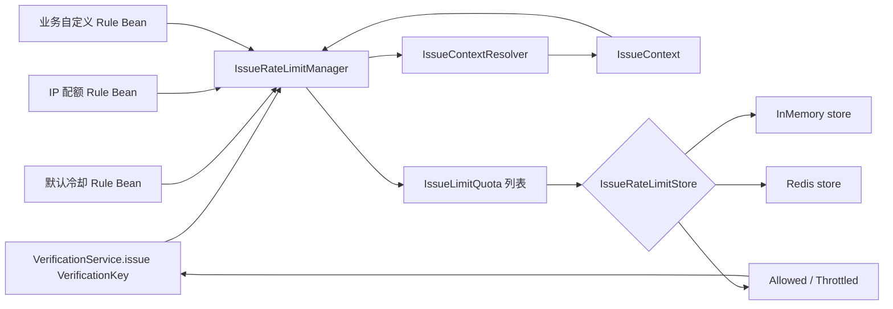
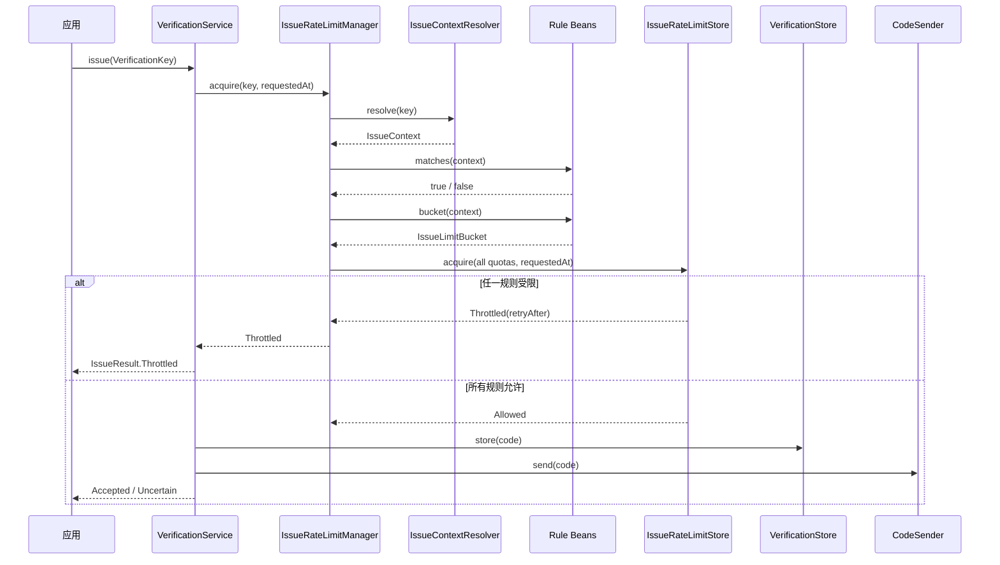

# 验证码签发限流架构

本文解释 `verification.limit` 包的设计和运行流程。该模块只负责限制“签发验证码”的频率，验证码校验失败次数仍由
`VerificationPolicy.maxAttempts` 和 `VerificationStore` 管理。

## 一、整体结构

限流体系由上下文解析器、规则、管理器和限流状态存储组成。



| 组件 | 职责 | 是否理解业务含义 |
| --- | --- | --- |
| `IssueContext` | 保存 `VerificationKey` 和应用提供的扩展属性 | 只保存数据，不解释属性 |
| `IssueContextResolver` | 根据验证码键集中采集 IP、设备等环境信号 | 是 |
| `IssueRateLimitRule` | 判断规则是否适用，并计算本次请求属于哪个额度桶 | 是 |
| `IssueLimitBucket` | 用多个字符串分段表达额度累计身份 | 不解释分段 |
| `IssueRateLimitManager` | 收集、匹配、校验规则并生成不可变签发配额 | 只负责编排 |
| `IssueLimitQuota` | 保存已经解析完成的规则 ID、额度桶、最大次数和窗口 | 否 |
| `IssueRateLimitStore` | 保存限流窗口状态，原子检查并消费全部签发配额 | 否 |
| `IssueRateLimiter` | 验证码服务依赖的顶层限流入口 | 否 |

`IssueRateLimitManager` 实现了 `IssueRateLimiter`。验证码服务只依赖 `IssueRateLimiter`，因此不知道应用使用了哪些规则，
也不知道额度保存在内存还是 Redis。

`IssueRateLimitStore` 只保存签发限流的窗口和额度消费状态；`VerificationStore` 保存验证码摘要、过期时间和验证尝试次数。
两者名称相似，但数据模型和生命周期不同，不应由同一个实现混合承担。

## 二、签发上下文

业务代码调用 `VerificationService.issue(key)` 时只需传递 `VerificationKey`，不负责构造限流上下文。
`IssueContextResolver` 在管理器内部根据当前运行环境集中创建 `IssueContext`。上下文包含两部分：

1. `VerificationKey`：框架已有的 `namespace`、`purpose` 和 `subject`。
2. `Map<String, String> attributes`：应用定义的 IP、设备、账号、租户等信息。

```java
VerificationKey key = new VerificationKey(
        "account",
        "login",
        "user@example.com");

IssueContextResolver resolver = key -> IssueContext.of(key)
        .with("ip-address", resolveTrustedClientIp())
        .with("device-id", resolveTrustedDeviceId());
```

core 不定义属性名常量。实际应用应在自己的模块中统一声明属性名，避免多个调用方使用不同拼写：

```java
public final class VerificationIssueAttributes {

    public static final String IP_ADDRESS = "ip-address";
    public static final String DEVICE_ID = "device-id";

    private VerificationIssueAttributes() {}
}
```

`IssueContext` 是不可变对象，`with` 会返回一个新实例。它的 `toString()` 不输出 subject 和属性值，避免邮箱、手机号、
IP 等信息意外进入日志。

core 不依赖 Servlet API，也不会默认解析 HTTP 请求。Spring Boot 自动配置提供的 Resolver 只创建包含验证码键的上下文。
Web 应用需要 IP 或设备规则时，可以在应用中覆盖它：

```java
@Bean
IssueContextResolver httpIssueContextResolver(ObjectProvider<HttpServletRequest> requests) {
    return key -> {
        HttpServletRequest request = requests.getObject();
        return IssueContext.of(key)
                .with("ip-address", resolveTrustedClientIp(request))
                .with("device-id", resolveTrustedDeviceId(request));
    };
}
```

不要直接信任任意客户端提交的 `X-Forwarded-For` 或设备标识。只有在反向代理链已经受信且应用正确配置转发头处理后，才能从转发头
提取客户端 IP；设备标识也应由应用完成签名校验或可信绑定。规则只消费解析后的属性，不应访问 `HttpServletRequest`。

## 三、规则如何工作

`IssueRateLimitRule` 是声明式接口。一条规则需要回答五个问题：

| 方法 | 问题 |
| --- | --- |
| `id()` | 这条规则的稳定名称是什么？ |
| `matches(context)` | 本次请求是否应该应用这条规则？ |
| `bucket(context)` | 本次请求的额度应该累计到哪个桶？ |
| `maxIssues()` | 一个窗口最多允许多少次？ |
| `window()` | 滚动窗口有多长？ |

规则 ID 必须是全局唯一的 kebab-case，例如 `login-ip-hour`。ID 会参与内存桶和 Redis key 的生成，修改 ID 等同于创建一条
全新的规则，其历史额度不会延续。

### 默认完整 Key 冷却规则

Spring Boot 自动配置默认注册 `default-key-cooldown`：

```text
bucket = namespace + purpose + subject
maxIssues = 1
window = ringo.boot.verification.issue-rate-limit.interval
```

默认窗口是 60 秒。例如：

```text
account + login + user@example.com
```

这表示同一个邮箱的登录验证码 60 秒内只能签发一次。将 `interval` 配置为 `0` 只会关闭这条默认规则，不会关闭应用注册的
其他 Rule Bean。

### 自定义 IP 规则

下面的规则只限制登录业务，同一 IP 一小时最多签发 10 次：

```java
@Bean
IssueRateLimitRule loginIpHourlyRule() {
    return IssueRateLimitRule.of(
            "login-ip-hour",
            context -> context.key().purpose().equals("login"),
            context -> IssueLimitBucket.of(
                    context.attribute("ip-address").orElseThrow()),
            10,
            Duration.ofHours(1));
}
```

`matches` 只判断业务是否适用。规则已经匹配后，如果生成 bucket 所需的属性缺失，应立即抛出异常，不应静默跳过安全规则。

### 组合额度桶

`IssueLimitBucket` 使用分段而不是让规则拼接字符串：

```java
context -> IssueLimitBucket.of(
        context.key().namespace(),
        context.key().purpose(),
        context.attribute("ip-address").orElseThrow())
```

分段设计可以避免以下两组数据产生相同的拼接结果：

```text
["ab", "c"]
["a", "bc"]
```

具体编码和 HMAC 由 `IssueRateLimitStore` 统一处理，Rule Bean 不应该生成 Redis key，也不应该自行散列敏感数据。

## 四、一次签发的完整流程



具体步骤如下：

1. 业务层使用 `VerificationKey` 调用验证码服务。
2. 管理器调用 `IssueContextResolver`，集中补充当前请求的可信环境信号。
3. 管理器按照 Spring 的有序 Bean 顺序遍历所有规则。
4. `matches=false` 的规则不参与本次签发。
5. 管理器先解析所有匹配规则的 bucket，任何规则解析失败时都不会访问限流状态存储。
6. 管理器将规则快照转换成 `IssueLimitQuota` 列表。
7. `IssueRateLimitStore` 在一个原子操作中检查所有签发配额。
8. 任一规则超限时返回最大的 `retryAfter`，并且不能消费其他规则的额度。
9. 所有规则允许时同时消费全部额度，然后验证码服务继续生成、存储和发送验证码。

限流额度一旦成功获取就视为已经消费。后续验证码生成、存储或发送失败，不会自动退还额度。这可以防止攻击者利用第三方发送失败
持续绕过签发频率限制。

## 五、为什么不是传统过滤器链

规则虽然由多个 Spring Bean 组成，但不能像 Servlet Filter 一样逐个检查并立即扣减：

```text
规则 A 扣减成功 -> 规则 B 拒绝 -> A 的额度已经被错误消耗
```

因此当前架构是“规则注册表 + 批量原子执行”，而不是“逐个执行的过滤器链”。所有匹配规则之间是 AND 关系：只有全部规则允许，
本次签发才允许。

`@Order` 只影响规则收集和诊断顺序，不影响最终结果，也不改变原子消费语义。

## 六、内存与 Redis 状态存储

### InMemoryIssueRateLimitStore

- 使用进程内 `Map` 和时间队列保存滚动窗口记录。
- 通过同步方法保证单 JVM 内多规则原子执行。
- 适合单元测试、本地开发和单实例应用。
- 多实例部署时每个实例拥有独立额度，不能用于生产级分布式限流。

### RedisIssueRateLimitStore

- 每个 `ruleId + bucket` 使用一个 Redis ZSET。
- ZSET score 是签发时间戳，member 是本次请求的随机标识。
- 一个 Lua 脚本完成所有窗口清理、额度检查和记录写入。
- 所有 key 使用同一个应用级 Redis hash tag，可以在 Redis Cluster 中进入同一 slot。
- bucket 各分段经过带长度编码的 HMAC-SHA256 摘要，不会在 Redis 中暴露手机号、邮箱或 IP。

示例 key：

```text
identity-service:verification:issue-limit:
{identity-service:verification:issue-limit}:
v2:login-ip-hour:{bucketDigest}
```

实际 key 是一行，上面仅为方便阅读进行了换行。更多 Redis 部署和密钥配置说明见
`ringo-boot-autoconfigure/.../verification/redis/README.md`。

## 七、Spring Boot 自动配置

启用验证码功能后，自动配置执行以下操作：

1. 根据 `store=memory|redis` 注册对应的 `IssueRateLimitStore`。
2. 在应用未提供时注册只包含 `VerificationKey` 的默认 `IssueContextResolver`。
3. 当 `interval` 不为零时注册 `default-key-cooldown` Rule Bean。
4. 收集容器内所有 `IssueRateLimitRule` Bean。
5. 创建 `IssueRateLimitManager`，并将它作为唯一默认 `IssueRateLimiter`。
6. 邮件和短信验证码服务注入该 `IssueRateLimiter`。

扩展和回退规则：

| 应用提供的 Bean | 自动配置行为 |
| --- | --- |
| `IssueRateLimitRule` | 与默认规则叠加 |
| `IssueContextResolver` | 替换默认解析器，为规则提供 IP、设备等应用信号 |
| `IssueRateLimitStore` | 使用自定义限流状态存储，仍自动收集所有规则 |
| `IssueRateLimiter` | 完全替换默认管理器和限流状态存储 |

## 八、推荐的初始规则

项目初期可以从以下三条规则开始，具体阈值应根据真实流量调整：

| 规则 | bucket | 示例阈值 |
| --- | --- | --- |
| 重发冷却 | namespace + purpose + subject | 60 秒 1 次 |
| 接收方小时配额 | subject | 1 小时 10 次 |
| 来源小时配额 | IP + purpose | 1 小时 50 次 |

不要把 IP 阈值设置得和单个邮箱或手机号一样低，公司、校园和移动网络可能有大量用户共享公网 IP。

## 九、实现自定义规则时的检查清单

- 使用稳定、唯一的 kebab-case `id`。
- `matches` 只负责业务匹配，不用它掩盖缺失的安全属性。
- 在 `IssueContextResolver` 中集中读取环境信号，不在 Rule Bean 中访问 HTTP 请求。
- bucket 中包含真正需要共享额度的字段，不包含无关字段。
- 不在 Rule Bean 中访问 Redis、数据库或远程服务。
- Rule Bean 保持无状态、线程安全，启动后不动态改变窗口和配额。
- 不在日志中输出 bucket 的原始分段。
- 多实例生产环境使用 Redis 状态存储或其他满足原子契约的自定义 `IssueRateLimitStore`。

有关业界常见限流层次和建议阈值，参见同目录下的 `limt.md`。

## 十、异常语义

| 场景 | 表达方式 | 含义 |
| --- | --- | --- |
| 参数为 null | `NullPointerException` | 调用方或扩展实现违反非空契约 |
| 规则、上下文或配额非法 | `IllegalArgumentException` | 配置或调用错误 |
| 正常达到签发上限 | `IssueLimitResult.Throttled` | 可预期的限流结果，不是异常 |
| Redis、网络或原子操作失败 | `IssueRateLimitException` | 限流基础设施技术故障 |

不要捕获并统一包装所有 `RuntimeException`。自定义 Store 应只把底层基础设施故障包装成 `IssueRateLimitException`；规则实现
缺少属性、返回空值或声明非法时应保留编程错误语义，便于开发阶段尽早发现问题。
