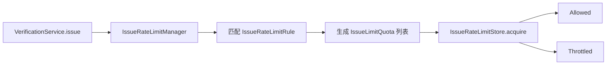

# IssueRateLimitStore 设计与实现

本文详细解释 `IssueRateLimitStore` 的职责、数据模型和 `InMemoryIssueRateLimitStore` 的实现逻辑。阅读本文不需要预先了解
限流算法，但建议先知道 `VerificationKey` 由 `namespace`、`purpose` 和 `subject` 组成。

## 一、IssueRateLimitStore 解决什么问题

验证码签发可能同时受到多条规则限制，例如：

- 同一个邮箱 60 秒最多签发 1 次。
- 同一个邮箱 1 小时最多签发 10 次。
- 整个应用 1 小时最多签发 1000 次。

规则负责描述“限制什么”，Store 负责记录“额度已经使用了多少”，并原子判断本次请求能否同时消费全部额度。



`IssueRateLimitStore` 不负责以下事情：

- 不匹配业务规则。
- 不解析 IP、设备或租户等上下文。
- 不生成验证码。
- 不保存验证码、过期时间或校验失败次数。
- 不发送短信或邮件。

验证码本身由 `VerificationStore` 保存。`IssueRateLimitStore` 只保存签发额度的使用状态，两者不能混用。

## 二、Rule、Bucket、Quota 和 Store 的关系

| 类型 | 职责 | 示例 |
| --- | --- | --- |
| `IssueRateLimitRule` | 定义适用条件、分桶方式、次数和窗口 | 同一邮箱 60 秒最多 2 次 |
| `IssueLimitBucket` | 表示额度累计到谁的名下 | `account + login + user@example.com` |
| `IssueLimitQuota` | 当前请求需要满足的一条完整额度 | 当前桶，60 秒最多 2 次 |
| `IssueRateLimitStore` | 保存使用历史，原子检查并消费全部额度 | 判断本次是否还能签发 |

`IssueLimitBucket` 只是额度身份，不包含最大次数、窗口或剩余次数。例如：

```text
IssueLimitBucket = [account, login, user@example.com]
```

它表示“账号登录业务中 `user@example.com` 对应的额度桶”。真正的额度定义在 `IssueLimitQuota`：

```java
IssueLimitQuota quota = new IssueLimitQuota(
        "account-login-subject-minute",
        IssueLimitBucket.of("account", "login", "user@example.com"),
        2,
        Duration.ofMinutes(1));
```

这条 Quota 的含义是：该规则下的这个桶，在任意滚动 1 分钟内最多成功获取 2 次签发名额。

## 三、acquire 契约

```java
IssueLimitResult acquire(List<IssueLimitQuota> quotas, Instant requestedAt);
```

一次调用可能携带多条 Quota。Store 必须遵守以下契约：

1. 先检查全部 Quota。
2. 只有全部 Quota 都有剩余额度时，才能同时消费一次额度。
3. 任意 Quota 已耗尽时，不得消费其他 Quota。
4. 多条 Quota 同时耗尽时，返回最大的 `retryAfter`。
5. 空 Quota 集合不是有效签发名额，必须拒绝。
6. Store 返回 `Allowed` 后，即使后续生成、存储或发送验证码失败，也不退还限流额度。

正常额度耗尽返回 `IssueLimitResult.Throttled`，不抛异常。Redis、网络或原子操作失败使用
`IssueRateLimitStoreException`；参数或实现违反契约时使用 Java 标准运行时异常。

## 四、InMemoryIssueRateLimitStore 保存什么

内存实现的核心结构是：

```java
Map<HistoryKey, History> histories;
```

逻辑结构如下：

```text
HistoryKey
├── ruleId
└── IssueLimitBucket

History
├── window
└── ArrayDeque<Instant> timestamps
```

每个 `ruleId + bucket` 对应一条历史记录。例如：

```text
HistoryKey:
  ruleId = account-login-subject-minute
  bucket = [account, login, user@example.com]

History:
  window = 60 秒
  timestamps = [10:00:00, 10:00:20]
```

`timestamps` 按时间保存该额度桶在当前滚动窗口内已经成功获取名额的时刻。不同规则即使生成相同 Bucket，也使用不同历史记录，
因为规则 ID 是历史键的一部分。

Store 还保存每条历史记录的窗口，并拒绝同一个规则 ID 在运行期间改变窗口。这样可以避免旧状态按照两种不同窗口解释。

## 五、一次 acquire 如何执行

`InMemoryIssueRateLimitStore.acquire` 使用一个同步临界区执行完整流程：

```text
校验参数
  ↓
逐条查找或创建历史记录
  ↓
移除各滚动窗口外的时间戳
  ↓
计算每条 Quota 是否耗尽以及 retryAfter
  ↓
任一耗尽 ── 是 ──> 不写入任何时间戳，返回 Throttled
  │
  否
  ↓
向全部历史队列写入 requestedAt
  ↓
返回 Allowed
```

方法使用 `synchronized`，因此同一 JVM 内不会有两个线程同时完成“检查”，然后都在额度只剩一次时成功写入。检查和写入作为一个
整体执行。

## 六、滚动窗口示例

假设规则为“同一邮箱 60 秒最多签发 2 次”。

| 请求时间 | 清理后的有效历史 | 判断 | 结果和新历史 |
| --- | --- | --- | --- |
| `10:00:00` | `[]` | `0 < 2` | Allowed，写入 `[10:00:00]` |
| `10:00:20` | `[10:00:00]` | `1 < 2` | Allowed，写入 `[10:00:00, 10:00:20]` |
| `10:00:30` | `[10:00:00, 10:00:20]` | `2 >= 2` | Throttled，等待 30 秒，不写入 |
| `10:01:00` | `[10:00:20]` | `1 < 2` | Allowed，写入 `[10:00:20, 10:01:00]` |

在 `10:01:00`，位于窗口左边界的 `10:00:00` 已经过期并被删除。这是滚动窗口，不是等到自然分钟边界统一清零。

当额度耗尽时，等待时间根据最早一条仍有效记录计算：

```text
retryAfter = 最早记录时间 + window - requestedAt
```

## 七、多配额为什么必须原子处理

假设一次签发同时命中：

```text
subject-minute：同一邮箱 1 分钟最多 1 次
subject-hour：同一邮箱 1 小时最多 10 次
application-hour：整个应用 1 小时最多 1000 次
```

如果 `subject-minute` 已耗尽，本次请求必须同时拒绝，而且不能增加 `subject-hour` 和 `application-hour` 的计数。否则请求虽然没有
签发验证码，却错误消耗了另外两条规则的额度。

因此 Store 不能逐条执行“检查并立即扣减”，而必须采用：

```text
检查全部额度 → 全部允许时一次性消费
```

内存实现通过 `synchronized` 保证单 JVM 原子性；Redis 实现通过一个 Lua 脚本保证多个 Redis key 的原子检查和写入。

## 八、历史清理

当前请求涉及的额度桶在每次 `acquire` 时都会立即删除过期时间戳。

此外，内存实现每处理 256 次 `acquire`，会扫描一次全部历史记录：

1. 删除各桶中过期的时间戳。
2. 删除已经没有任何有效时间戳的空桶。

周期清理用于避免不再访问的邮箱、手机号或 IP 对应桶永久保留在 Map 中。它只影响内存占用，不改变限流结果。

## 九、严格额度语义

当前限流体系采用 fail-closed 策略：

| 场景 | 处理方式 |
| --- | --- |
| Manager 没有配置任何规则 | 创建 Manager 时抛出 `MissingIssueRateLimitRuleException` |
| 有规则，但当前 `VerificationKey` 没有匹配规则 | 拒绝签发并抛出 `MissingIssueRateLimitRuleException` |
| Store 收到空 Quota 集合 | 抛出 `IllegalArgumentException` |
| Quota 存在，但 Store 中没有桶历史 | 视为新桶，拥有完整初始额度 |
| Quota 存在且额度尚未耗尽 | 记录本次时间并返回 `Allowed` |
| Quota 存在但额度已经耗尽 | 不记录本次时间并返回 `Throttled` |

因此，“存储中没有历史记录”和“没有配置额度”是两个完全不同的概念。需要明确关闭限流时，应使用
`IssueRateLimiter.permitAll()`，不能依靠遗漏配置隐式绕过限流。

## 十、使用限制

`InMemoryIssueRateLimitStore` 适用于：

- 单元测试。
- 本地开发。
- 明确只运行一个实例的简单应用。

它不适用于多实例生产环境，原因包括：

- 每个 JVM 拥有独立 Map，多个实例会分别计算额度。
- 应用重启后全部限流记录丢失。
- 不能在不同服务进程之间保证原子消费。

多实例应用应使用 `RedisIssueRateLimitStore` 或实现满足相同契约的分布式 Store。

## 十一、自定义 Store 检查清单

实现自定义 `IssueRateLimitStore` 时应确认：

- 空 Quota 集合会被拒绝。
- 所有 Quota 采用全有或全无的原子消费。
- 并发请求不会突破最大次数。
- 多条规则受限时返回最大的 `retryAfter`。
- 滚动窗口边界和过期记录清理正确。
- `ruleId + bucket` 能稳定区分历史记录。
- 不在日志或外部存储 key 中暴露邮箱、手机号、IP 等 Bucket 原始分段。
- 分布式部署时能够跨进程保持原子性。
- 只用 `IssueRateLimitStoreException` 包装基础设施故障，不掩盖配置或编程错误。
