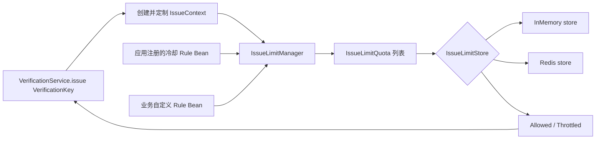
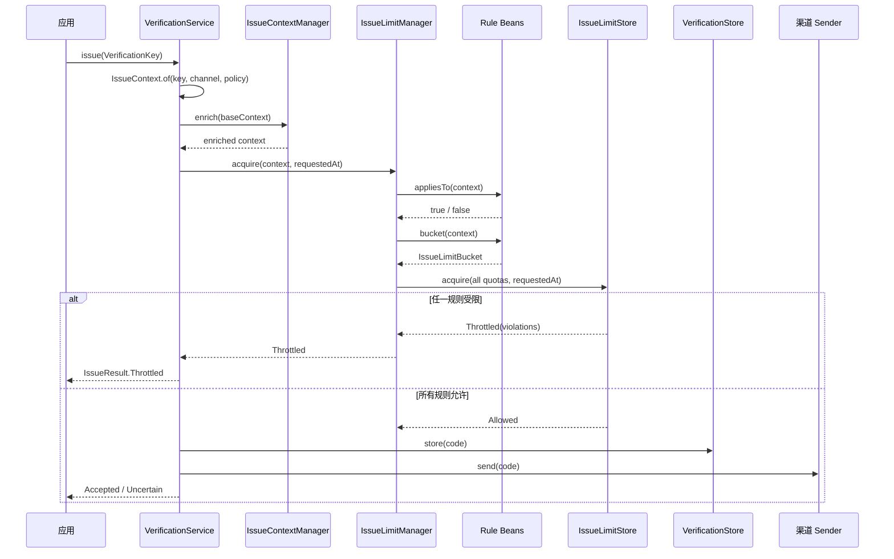

# 验证码签发限流架构

本文解释 `verification.limit` 包的设计和运行流程。该模块只负责限制“签发验证码”的频率，验证码校验失败次数仍由
`VerificationPolicy.maxAttempts` 和 `VerificationStore` 管理。

## 一、整体结构

限流体系由签发服务创建的上下文、规则、管理器和限流状态存储组成。



| 组件 | 职责 | 是否理解业务含义 |
| --- | --- | --- |
| `IssueContext` | 保存 `VerificationKey`、渠道和应用提供的扩展属性 | 只保存数据，不解释属性 |
| `IssueLimitRule` | 判断规则是否适用，并计算本次请求属于哪个额度桶 | 是 |
| `IssueLimitBucket` | 用多个字符串分段表达额度累计身份 | 不解释分段 |
| `IssueLimitManager` | 收集、匹配、校验规则并生成不可变签发配额 | 只负责编排 |
| `IssueLimitQuota` | 保存已经解析完成的规则 ID、额度桶、最大次数和窗口 | 否 |
| `IssueLimitStore` | 保存限流窗口状态，原子检查并消费全部签发配额 | 否 |
| `IssueLimiter` | 验证码服务依赖的顶层限流入口 | 否 |

`IssueLimitManager` 实现了 `IssueLimiter`。验证码服务只依赖 `IssueLimiter`，因此不知道应用使用了哪些规则，
也不知道额度保存在内存还是 Redis。

`IssueLimitStore` 只保存签发限流的窗口和额度消费状态；`VerificationStore` 保存验证码摘要、过期时间和验证尝试次数。
两者名称相似，但数据模型和生命周期不同，不应由同一个实现混合承担。

有关 Store 的职责、`InMemoryIssueLimitStore` 数据结构、滚动窗口算法和多配额原子消费的逐步说明，参见
同目录下的 [`IssueLimitStore.md`](IssueLimitStore.md)。

## 二、签发上下文

业务代码调用 `VerificationService.issue(key)` 时只需传递 `VerificationKey`。`AbstractVerificationService` 在入口创建
`IssueContext`，再由 `IssueContextManager` 按顺序执行容器中的 `IssueContextContributor`，补充请求级环境信息或流程属性。
最终上下文包含三部分：

1. `VerificationKey`：框架已有的 `namespace`、`purpose` 和 `subject`。
2. `VerificationChannel`：稳定的邮件、短信或自定义渠道标识。
3. `Map<String, String> attributes`：应用定义的 IP、设备、账号、租户等信息。

Web 应用可以显式开启自动配置的 `ClientIpContributor`：

```yaml
ringo:
  boot:
    verification:
      contributor:
        client-ip: true
```

该开关默认为 `false`。开启后，Servlet Web 应用会把 `HttpServletRequest.getRemoteAddr()` 返回的值写入
`ClientIpQuotaRule.ATTRIBUTE_NAME` 对应的上下文属性。其他环境信号可由应用实现并注册自定义
`IssueContextContributor` Bean。

`IssueContext` 是不可变对象，`with` 会返回一个新实例。它的 `toString()` 不输出 subject 和属性值，避免邮箱、手机号、
IP 等信息意外进入日志。

不要直接信任任意客户端提交的 `X-Forwarded-For` 或设备标识。`ClientIpContributor` 不会自行解析代理请求头；
反向代理场景必须先在可信 Servlet 基础设施中配置远端地址解析。设备标识也应由应用完成签名校验或可信绑定。
规则只消费已写入上下文的属性，不应访问 `HttpServletRequest`。

## 三、规则如何工作

`IssueLimitRule` 是声明式接口。一条规则需要回答五个问题：

| 方法 | 问题 |
| --- | --- |
| `id()` | 这条规则的稳定名称是什么？ |
| `appliesTo(context)` | 本次请求是否应该应用这条规则？ |
| `bucket(context)` | 本次请求的额度应该累计到哪个桶？ |
| `maxIssues()` | 一个窗口最多允许多少次？ |
| `window()` | 滚动窗口有多长？ |

四种内置规则会根据规则类型和全部定义参数自动生成全局唯一 ID，不需要手动调用 `id(...)`。例如，接收方每分钟最多签发 5 次的
规则会生成：

```text
rule:subject-quota@ns:account@purpose:email-verification@channel:email@issues:5@window:1minutes
```

窗口使用能够精确表达该 `Duration` 的最大单位，因此 `Duration.ofSeconds(60)` 与 `Duration.ofMinutes(1)` 会生成相同 ID。
自定义 `IssueLimitRule` 仍应返回稳定、唯一的 kebab-case ID，例如 `login-ip-hour`。

ID 会参与内存桶和 Redis key 的生成。内置规则修改 namespace、purpose、channel、maxIssues 或 window 后会生成新的 ID，等同于
创建一条全新的规则，其历史额度不会延续。

### 默认行为与严格管理器

Spring Boot 自动配置不注册内置 `IssueLimitRule`。应用没有提供规则或自定义限流器时，自动配置使用
`IssueLimiter.permitAll()`，不会创建限流状态 Store。应用注册任意规则 Bean 后才会创建 Store 和
`IssueLimitManager`，正式启用签发限流。

限流管理器采用严格拒绝策略：规则集合为空时无法创建；存在规则但没有任何规则匹配当前 `VerificationKey` 时，签发请求抛出
`MissingIssueLimitRuleException`。因此应用自定义规则后，必须让这些 Bean 覆盖全部预期业务。
应用也可以提供自定义 `IssueLimiter`，完全替换基于规则和 Store 的默认管理器。

`IssueLimitBucket` 只是额度累计身份，`IssueLimitQuota` 才定义窗口和最大次数。Store 中尚不存在某个桶的历史记录表示这是新桶，
第一次请求拥有完整初始额度；没有匹配出任何 `IssueLimitQuota` 才属于配置缺失。

### 重发冷却

重发冷却是 `SubjectQuotaRule` 的一种特殊配置：将 `maxIssues` 设置为 `1`，将 `window` 设置为两次签发之间的最短间隔。
该规则按 namespace、purpose、channel 和 subject 隔离，邮件、短信以及自定义渠道需要分别注册 Bean。

固定的一次额度是“冷却”的必要语义：例如 60 秒冷却意味着两次签发至少间隔 60 秒。如果一个 60 秒窗口允许两次，用户可以在同一时刻
连续签发两次，这属于窗口配额而不是重发冷却。需要“一个窗口最多 N 次”时，应使用后文的周期配额规则。

```java
@Bean
IssueLimitRule loginEmailResendCooldownRule() {
    return SubjectQuotaRule.builder()
            .namespace("account")
            .purpose("login")
            .channel(VerificationChannel.EMAIL)
            .maxIssues(1)
            .window(Duration.ofSeconds(60))
            .build();
}
```

Spring Boot 不会默认注册该规则；只有应用主动提供规则 Bean 时才会启用签发限流。

### 周期配额规则

core 提供三种周期配额规则。它们覆盖的范围逐级扩大，并且可以作为多个 Spring Bean 同时注册：

| 规则 | 匹配范围 | 额度桶 |
| --- | --- | --- |
| `SubjectQuotaRule` | namespace + purpose + channel | namespace + purpose + channel + subject |
| `PurposeQuotaRule` | namespace + purpose + channel | namespace + purpose + channel |
| `NamespaceQuotaRule` | namespace + channel | namespace + channel |

三种规则都强制绑定一个 `VerificationChannel`，不同渠道拥有独立额度。应用需要为实际使用的渠道分别注册规则 Bean。同一范围需要小时、天等
多个窗口时，每个规则必须使用不同且稳定的 ID；建议在 ID 中包含渠道和窗口：

```java
@Bean
IssueLimitRule loginSubjectHourlyRule() {
    return SubjectQuotaRule.builder()
            .namespace("account")
            .purpose("login")
            .channel(VerificationChannel.EMAIL)
            .maxIssues(5)
            .window(Duration.ofHours(1))
            .build();
}

@Bean
IssueLimitRule loginSubjectDailyRule() {
    return SubjectQuotaRule.builder()
            .namespace("account")
            .purpose("login")
            .channel(VerificationChannel.EMAIL)
            .maxIssues(10)
            .window(Duration.ofDays(1))
            .build();
}

@Bean
IssueLimitRule loginPurposeMinuteRule() {
    return PurposeQuotaRule.builder()
            .namespace("account")
            .purpose("login")
            .channel(VerificationChannel.EMAIL)
            .maxIssues(100)
            .window(Duration.ofMinutes(1))
            .build();
}

@Bean
IssueLimitRule accountNamespaceHourlyRule() {
    return NamespaceQuotaRule.builder()
            .namespace("account")
            .channel(VerificationChannel.EMAIL)
            .maxIssues(1000)
            .window(Duration.ofHours(1))
            .build();
}
```

所有匹配规则以 AND 关系一次性提交给 Store。任何一条配额不足时，本次签发不会消费其他规则的额度。上述数值仅用于展示 API，框架不提供
默认阈值，也不会自动注册这些规则。

### 全局额度规则

使用固定的 `IssueLimitBucket` 可以让当前 `IssueLimitStore` 隔离范围内的全部验证码签发共享额度。内存 Store 下它只覆盖
当前 JVM；Redis Store 的 key 包含应用名称，因此默认覆盖同一应用名称的全部实例。该规则适合作为应用级突发流量兜底，不能
替代短信或邮件供应商自己的发送配额和告警。

```java
final class ApplicationHourlyRule implements IssueLimitRule {
    public String id() {
        return "application-hour";
    }

    public boolean appliesTo(IssueContext context) {
        return true;
    }

    public IssueLimitBucket bucket(IssueContext context) {
        return IssueLimitBucket.of("application");
    }

    public int maxIssues() {
        return 1_000;
    }

    public Duration window() {
        return Duration.ofHours(1);
    }
}
```

### 客户端 IP 规则

下面的规则限制指定 namespace、purpose 和 channel，同一 IP 一小时最多签发 10 次：

```java
ClientIpQuotaRule.builder()
        .namespace("account")
        .purpose("login")
        .channel(VerificationChannel.EMAIL)
        .maxIssues(10)
        .window(Duration.ofHours(1))
        .build();
```

`appliesTo` 只判断业务是否适用。规则已经匹配后，如果生成 bucket 所需的属性缺失，应立即抛出异常，不应静默跳过安全规则。

### 组合额度桶

`IssueLimitBucket` 使用分段而不是让规则拼接字符串：

```java
context -> IssueLimitBucket.of(
        context.key().namespace(),
        context.key().purpose(),
        context.attribute("ip-address").orElseThrow())
```

分段设计可以避免以下两组数据产生相同的拼接结果：

```text
["ab", "c"]
["a", "bc"]
```

具体编码和 HMAC 由 `IssueLimitStore` 统一处理，Rule Bean 不应该生成 Redis key，也不应该自行散列敏感数据。

## 四、一次签发的完整流程



具体步骤如下：

1. 业务层使用 `VerificationKey` 调用验证码服务。
2. 签发服务创建包含验证码键和渠道的基础上下文，并通过模板钩子补充可信环境信号或流程属性。
3. 模板校验定制结果；子类不能替换验证码键或渠道。
4. 管理器按照 Spring 的有序 Bean 顺序遍历所有规则。
5. `appliesTo=false` 的规则不参与本次签发。
6. 管理器先解析所有匹配规则的 bucket，任何规则解析失败时都不会访问限流状态存储。
7. 管理器将规则快照转换成 `IssueLimitQuota` 列表。
8. `IssueLimitStore` 在一个原子操作中检查所有签发配额。
9. 任一规则超限时返回全部受限规则的 `ruleId` 和各自 `retryAfter`，总体等待时间取最大值，并且不能消费其他规则的额度。
10. 所有规则允许时同时消费全部额度，然后验证码服务使用同一个上下文继续生成、存储和发送验证码。

限流额度一旦成功获取就视为已经消费。后续验证码生成、存储或发送失败，不会自动退还额度。这可以防止攻击者利用第三方发送失败
持续绕过签发频率限制。

## 五、为什么不是传统过滤器链

规则虽然由多个 Spring Bean 组成，但不能像 Servlet Filter 一样逐个检查并立即扣减：

```text
规则 A 扣减成功 -> 规则 B 拒绝 -> A 的额度已经被错误消耗
```

因此当前架构是“规则注册表 + 批量原子执行”，而不是“逐个执行的过滤器链”。所有匹配规则之间是 AND 关系：只有全部规则允许，
本次签发才允许。

`@Order` 只影响规则收集和诊断顺序，不影响最终结果，也不改变原子消费语义。

## 六、内存与 Redis 状态存储

### InMemoryIssueLimitStore

- 使用进程内 `Map` 和时间队列保存滚动窗口记录。
- 通过同步方法保证单 JVM 内多规则原子执行。
- 适合单元测试、本地开发和单实例应用。
- 多实例部署时每个实例拥有独立额度，不能用于生产级分布式限流。

详细实现示例参见 [`IssueLimitStore.md`](IssueLimitStore.md)。

### RedisIssueLimitStore

- 每个 `ruleId + bucket` 使用一个 Redis ZSET。
- ZSET score 是签发时间戳，member 是本次请求的随机标识。
- 一个 Lua 脚本完成所有窗口清理、额度检查和记录写入。
- 所有 key 使用同一个应用级 Redis hash tag，可以在 Redis Cluster 中进入同一 slot。
- bucket 各分段经过带长度编码的 HMAC-SHA256 摘要，不会在 Redis 中暴露手机号、邮箱或 IP。

示例 key：

```text
{identity-service:verification:issue-limit}:v1:login-ip-hour:{bucketDigest}
```

花括号中的内容是 Redis Cluster hash tag，也是 key 的真实组成部分。更多 Redis 部署和密钥配置说明见
`ringo-boot-autoconfigure/.../verification/redis/README.md`。

## 七、Spring Boot 自动配置

启用验证码功能后，自动配置执行以下操作：

1. 应用没有提供规则或自定义 Limiter 时，注册 `IssueLimiter.permitAll()`。
2. 应用提供规则 Bean 时，根据 `store=memory|redis` 注册对应的 `IssueLimitStore`。
3. 收集容器内所有 `IssueLimitRule` Bean，并创建 `IssueLimitManager`。
4. 邮件和短信验证码服务注入最终的 `IssueLimiter`。

限流规则不支持 YAML 配置。应用提供任意规则 Bean 即表示启用限流。如果自定义规则只覆盖部分业务，应用可以启动，但未被任何规则
覆盖的 `namespace + purpose` 会在首次签发时抛出配置异常，不会生成、存储或发送验证码。

下面展示如何把前文定义的具名规则注册到 Spring 容器：

```java
@Bean
IssueLimitRule applicationHourlyRule() {
    return new ApplicationHourlyRule();
}

@Bean
IssueLimitRule loginIpHourlyRule() {
    return new LoginIpHourlyRule();
}
```

业务级或接收方级配额可以直接注册 `NamespaceQuotaRule`、`PurposeQuotaRule` 或 `SubjectQuotaRule`。
接收方地址来自运行时 `VerificationKey.subject`，不应硬编码邮箱或手机号。所有 Rule Bean 的 ID 必须全局唯一，重复时应用启动失败。

各渠道服务可以共享同一个 `IssueLimiter`。`IssueLimitManager` 会将完整 `IssueContext` 传给
`IssueLimitRule.appliesTo` 并仅执行匹配的规则，无需在创建 Manager 前按 channel 预先过滤。单渠道规则应在
`appliesTo` 中比较 `IssueContext.channel`；有意忽略 channel 则表示该规则共享多个渠道的配额。

扩展和回退规则：

| 应用提供的 Bean | 自动配置行为 |
| --- | --- |
| 无 | 使用 `IssueLimiter.permitAll()`，不创建限流 Store |
| `IssueLimitRule` | 收集所有应用规则，并自动创建 Store 和 `IssueLimitManager` |
| `IssueLimitStore` | 使用自定义限流状态存储，仍自动收集所有规则 |
| `IssueLimiter` | 完全替换默认管理器和框架自动创建的限流状态存储 |

需要向上下文增加 IP、设备或租户等应用信号时，应注册 `IssueContextContributor` Bean。Servlet Web 应用可通过
`ringo.boot.verification.contributor.client-ip=true` 开启内置的 `ClientIpContributor`。

## 八、推荐的初始规则

项目初期可以从以下三条规则开始，具体阈值应根据真实流量调整：

| 规则 | bucket | 示例阈值 |
| --- | --- | --- |
| 应用级兜底 | global | 1 小时按实际容量配置 |
| 重发冷却 | namespace + purpose + channel + subject | 60 秒 1 次 |
| 接收方小时配额 | namespace + purpose + channel + subject | 1 小时 10 次 |
| 来源小时配额 | IP + purpose | 1 小时 50 次 |

不要把 IP 阈值设置得和单个邮箱或手机号一样低，公司、校园和移动网络可能有大量用户共享公网 IP。
应用级规则应按自身容量设置；短信和邮件供应商的账户余额、日配额及服务异常仍应在 Sender 集成层监控和保护。

## 九、实现自定义规则时的检查清单

- 自定义规则使用稳定、唯一的 kebab-case `id`；内置规则的 ID 由定义参数自动生成。
- `appliesTo` 只负责业务匹配，不用它掩盖缺失的安全属性。
- 通过 `IssueContextContributor` 集中读取环境信号，不在 Rule Bean 中访问 HTTP 请求。
- bucket 中包含真正需要共享额度的字段，不包含无关字段。
- 不在 Rule Bean 中访问 Redis、数据库或远程服务。
- Rule Bean 保持无状态、线程安全，启动后不动态改变窗口和配额。
- 不在日志中输出 bucket 的原始分段。
- 多实例生产环境使用 Redis 状态存储或其他满足原子契约的自定义 `IssueLimitStore`。

有关业界常见限流层次和建议阈值，参见同目录下的 `limt.md`。

## 十、异常语义

| 场景 | 表达方式 | 含义 |
| --- | --- | --- |
| 参数为 null | `NullPointerException` | 调用方或扩展实现违反非空契约 |
| 规则、上下文或配额非法 | `IllegalArgumentException` | 配置或调用错误 |
| 没有规则或当前业务未被规则覆盖 | `MissingIssueLimitRuleException` | 严格拒绝签发的限流配置错误 |
| 正常达到签发上限 | `IssueLimitResult.Throttled` | 可预期的限流结果，不是异常 |
| Redis、网络或原子操作失败 | `IssueLimitStoreException` | 限流基础设施技术故障 |

不要捕获并统一包装所有 `RuntimeException`。自定义 Store 应只把底层基础设施故障包装成 `IssueLimitStoreException`；规则实现
缺少属性、返回空值或声明非法时应保留编程错误语义，便于开发阶段尽早发现问题。
