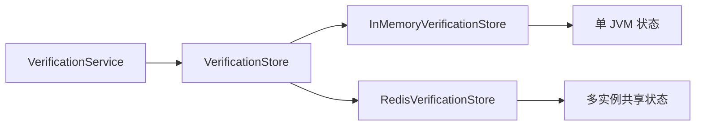
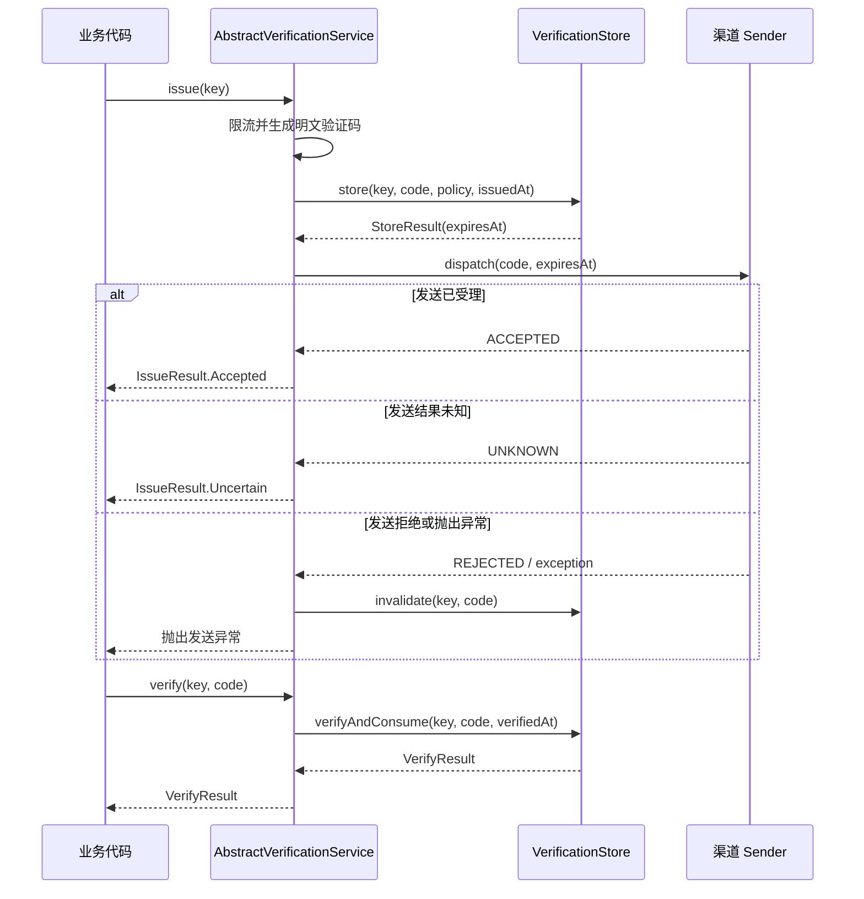
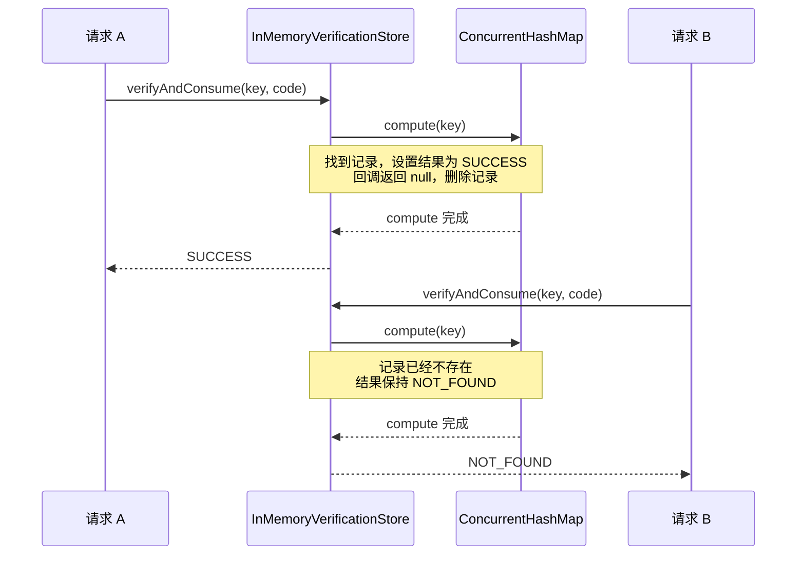

# 验证码状态存储说明

本文解释 `verification.store` 包的职责、数据模型和运行流程。这里的 Store 不是保存业务用户数据，
而是暂时保存一个验证码从“已签发”到“已消费或失效”之间的状态。

## 一、为什么需要 VerificationStore

验证码服务需要解决以下状态问题：

- 同一个业务、用途和接收方当前签发了哪个验证码。
- 验证码什么时候过期。
- 用户还可以尝试校验多少次。
- 验证码成功使用后如何保证不能再次使用。
- 多个请求同时校验时，如何保证最多只有一个请求成功。

`VerificationStore` 将这些职责从邮件、短信等渠道服务中抽离。`AbstractVerificationService` 只负责编排
生成、存储、派发、补偿和校验流程，不需要知道状态保存在 JVM 内存还是 Redis。



## 二、包内类型的职责

| 类型 | 职责 |
| --- | --- |
| `VerificationStore` | 定义保存、校验并消费、按验证码失效三种原子操作。 |
| `InMemoryVerificationStore` | 基于 `ConcurrentHashMap` 的线程安全内存实现。 |
| `StoreResult` | 返回验证码成功保存后计算出的过期时间。 |
| `VerificationStoreException` | 统一表达 Redis、数据库或第三方存储的连接、超时、序列化及原子操作故障。 |

`VerificationStoreException` 是运行时异常，但接口方法仍显式声明它，目的是提醒实现者和调用者：存储操作可能因
基础设施故障而失败。自定义实现应把供应商异常包装成该异常，不应把 Lettuce、JDBC 等底层异常直接泄露给上层。

## 三、验证码记录由什么确定

一条验证码记录由 `VerificationKey` 唯一确定：

```java
VerificationKey key = new VerificationKey(
        "account",
        "login",
        "user@example.com");
```

三个分段分别表示：

| 分段 | 示例 | 含义 |
| --- | --- | --- |
| `namespace` | `account` | 验证码所属业务模块。 |
| `purpose` | `login` | 验证码的业务用途。 |
| `subject` | `user@example.com` | 本次验证的主体，例如邮箱、手机号或账号。 |

因此，下面任意分段不同都会形成独立记录：

```text
account + login    + user@example.com
account + register + user@example.com
payment + login    + user@example.com
account + login    + other@example.com
```

对同一个 `VerificationKey` 再次执行 `store` 会覆盖旧记录。重发新验证码后，旧验证码立即失效。

## 四、VerificationStore 的三个操作

### store：保存新验证码

```java
StoreResult store(
        VerificationKey key,
        String code,
        VerificationPolicy policy,
        Instant issuedAt);
```

Store 根据 `issuedAt + policy.ttl()` 计算过期时间，并保存：

- 验证码的安全摘要。
- 过期时间。
- `policy.maxAttempts()` 提供的最大校验次数。

返回的 `StoreResult.expiresAt()` 会继续传给发送渠道和 `IssueResult`，保证存储、邮件或短信内容以及接口响应使用同一个
过期时间。

### verifyAndConsume：校验并消费验证码

```java
VerifyResult verifyAndConsume(
        VerificationKey key,
        String code,
        Instant verifiedAt);
```

该方法不是普通的只读查询，而是一个原子状态变更操作：

| 返回值 | 条件 | 调用后的记录状态 |
| --- | --- | --- |
| `NOT_FOUND` | 对应 Key 没有记录。 | 仍然不存在。 |
| `EXPIRED` | 校验时间已经达到或超过过期时间。 | 删除。 |
| `MISMATCH` | 验证码不匹配，但仍有剩余次数。 | 扣减一次，继续保留。 |
| `ATTEMPTS_EXHAUSTED` | 本次错误校验耗尽最后一次机会。 | 删除。 |
| `SUCCESS` | 验证码匹配且未过期。 | 删除，不能再次使用。 |

这里的“消费”是指成功后立即删除验证码。校验和删除必须在同一个原子操作中完成，否则两个并发请求可能都先读取到
有效验证码，然后同时返回成功。

### invalidate：按 Key 和验证码失效

```java
boolean invalidate(VerificationKey key, String code);
```

只有 Key 和验证码都匹配当前记录时才会删除并返回 `true`。同时匹配验证码非常重要，它避免下面的竞态条件：

1. 请求 A 保存验证码 `111111`，随后发送失败。
2. 请求 B 已经为同一个 Key 保存了新验证码 `222222`。
3. 请求 A 执行失败补偿时，只允许删除 `111111`，不能误删请求 B 的新验证码。

## 五、一次签发和校验的完整流程



验证码必须先存储再发送。否则发送渠道很快完成投递时，用户可能在验证码尚未保存的短暂窗口内提交校验并得到
`NOT_FOUND`。

当发送明确拒绝或抛出异常时，服务会调用 `invalidate` 撤销刚保存的验证码。发送结果为 `UNKNOWN` 时不会撤销，因为供应商
可能已经完成投递；调用方得到 `IssueResult.Uncertain` 后可以提示用户稍后重试或重新获取。

如果发送异常且撤销操作也失败，原始发送异常仍然是主异常，撤销异常会作为 suppressed exception 附加，便于服务端诊断。

## 六、InMemoryVerificationStore 如何存储

内存实现的核心结构是：

```text
ConcurrentHashMap<VerificationKey, Entry>

Entry:
  digest            验证码的 HMAC-SHA256 摘要
  expiresAt         过期时间
  remainingAttempts 剩余校验次数
```

以登录验证码为例，逻辑数据类似：

```text
key:
  VerificationKey("account", "login", "user@example.com")

value:
  Entry(
    digest = <32 字节 HMAC 摘要>,
    expiresAt = 2026-08-22T10:05:00Z,
    remainingAttempts = 5
  )
```

内存实现不会把明文验证码放入 `Entry`，但 Map 的 Key 本身仍是 `VerificationKey`，因此邮箱或手机号等 subject 会存在于
当前 JVM 内存中。Redis 实现会进一步对 Redis key 中的敏感分段进行摘要处理。

### 验证码摘要如何生成

每个 `InMemoryVerificationStore` 实例创建时生成一个 32 字节随机密钥。摘要输入依次为：

```text
namespace + purpose + subject + code
```

实际计算不是直接拼接字符串，而是为每个 UTF-8 字节序列添加四字节长度前缀：

```text
length(namespace) | namespace
length(purpose)   | purpose
length(subject)   | subject
length(code)      | code
```

长度前缀可以区分 `("ab", "c")` 和 `("a", "bc")` 这类直接拼接后结果相同的输入。将完整
`VerificationKey` 纳入摘要，也可以防止一个 Key 下的摘要被错误复用到另一个 Key。

校验时重新计算候选摘要，并通过 `MessageDigest.isEqual` 进行常量时间比较，减少普通字节逐位比较可能产生的时序信息泄露。
进程重启后随机密钥改变，内存记录也会同时丢失，不需要持久化该密钥。

### 原子操作如何实现

`ConcurrentHashMap.compute(key, ...)` 会对指定 Key 原子地完成读取和更新。`verifyAndConsume` 在一次 `compute` 中执行：

1. 判断记录是否存在。
2. 判断是否过期。
3. 比较验证码摘要。
4. 扣减剩余次数，或删除已经成功、过期、次数耗尽的记录。

因此，多个线程可以同时校验不同的 Key；多个线程同时校验同一个 Key 时，状态变更按顺序完成。验证码成功后记录在该原子操作
内被删除，后续线程只能得到 `NOT_FOUND`。

`compute` 回调的返回值决定 Map 中该 Key 的新状态：

| 回调返回值 | Map 状态 | 使用场景 |
| --- | --- | --- |
| `null` | 删除该 Key 的记录；原本不存在时继续保持不存在。 | 未找到、成功、过期或尝试次数耗尽。 |
| `existing.withRemainingAttempts(...)` | 使用剩余次数更少的新 `Entry` 替换旧状态。 | 验证码不匹配但仍可继续尝试。 |

例如，两个请求同时使用正确验证码校验同一个 Key：



检查摘要和删除记录发生在同一次 `compute` 中，不存在两个请求都先读取到有效记录、再分别删除的窗口。因此同一个验证码最多只有
一个并发请求得到 `SUCCESS`。

### AtomicReference 是否负责原子更新

不负责。验证码状态更新的原子性来自 `ConcurrentHashMap.compute`，`AtomicReference<VerifyResult>` 只是把回调中得到的
校验结果传递到回调外：

```java
AtomicReference<VerifyResult> result =
        new AtomicReference<>(VerifyResult.NOT_FOUND);

entries.compute(key, (ignored, existing) -> {
    // 根据 existing 判断并更新 Map 状态
    result.set(VerifyResult.SUCCESS);
    return null;
});

return result.get();
```

之所以需要一个可变容器，是因为 Java Lambda 捕获的局部变量必须是 `final` 或 effectively final，不能在回调中直接给普通
局部变量重新赋值：

```java
VerifyResult result = VerifyResult.NOT_FOUND;

entries.compute(key, (ignored, existing) -> {
    result = VerifyResult.SUCCESS; // 无法编译
    return null;
});
```

`compute` 会在当前方法调用中同步执行完回调，然后方法才调用 `result.get()`。这里不使用 `AtomicReference` 的 CAS 操作，也不依赖
它的内存可见性能力来保护 `Entry`。换成其他能够被 Lambda 捕获的结果容器，也不会改变 Map 状态的原子性。

`invalidate` 中的 `AtomicBoolean` 作用相同：它只负责把“是否删除成功”从 `computeIfPresent` 回调传递出来。摘要比较与条件删除
仍然由 `computeIfPresent` 作为一个原子操作完成，不是由 `AtomicBoolean` 保证。

| 组件 | 实际职责 |
| --- | --- |
| `ConcurrentHashMap.compute` | 原子完成同一个 Key 的读取、判断、扣减和删除。 |
| `ConcurrentHashMap.computeIfPresent` | 在记录存在时原子完成摘要比较和条件删除。 |
| `AtomicReference<VerifyResult>` | 将校验结果从 Lambda 回调传递到方法返回值。 |
| `AtomicBoolean` | 将条件删除结果从 Lambda 回调传递到方法返回值。 |
| `MessageDigest.isEqual` | 以常量时间比较摘要，不负责并发控制。 |

## 七、状态变化示例

假设策略为有效期 5 分钟、最多尝试 3 次：

```text
10:00:00  store("123456")
          状态：摘要已保存，10:05:00 过期，剩余 3 次

10:01:00  verify("000000") -> MISMATCH
          状态：记录保留，剩余 2 次

10:02:00  verify("123456") -> SUCCESS
          状态：记录删除

10:02:01  verify("123456") -> NOT_FOUND
```

如果连续三次输入错误，第三次返回 `ATTEMPTS_EXHAUSTED` 并删除记录。即使随后输入正确验证码，也只能得到 `NOT_FOUND`，
必须重新签发。

过期边界采用左闭规则：当 `verifiedAt` 等于 `expiresAt` 时已经过期，返回 `EXPIRED` 并删除记录。

## 八、内存实现的适用边界

`InMemoryVerificationStore` 适用于：

- 单元测试和集成测试。
- 本地开发。
- 明确只运行一个 JVM、且允许重启后验证码全部失效的简单应用。

它不适合多实例生产部署，原因包括：

- 每个 JVM 拥有独立 Map，同一个验证码无法在其他实例校验。
- 负载均衡可能把签发和校验请求路由到不同实例。
- 应用重启后所有未过期验证码和失败尝试次数都会丢失。
- 无法在多个进程之间保证一次性消费。

多实例部署应使用满足 `VerificationStore` 原子契约的共享存储。项目提供的 `RedisVerificationStore` 位于
`ringo-boot-autoconfigure` 模块，其 Redis key、Hash value、HMAC 密钥和部署方式参见：

[Redis 验证码存储部署指南](../../../../../../../../../../ringo-boot-autoconfigure/src/main/java/io/github/ringotangs/ringoboot/autoconfigure/verification/redis/README.md)

## 九、不要和签发限流 Store 混淆

项目中还有一个名称相似的 `IssueRateLimitStore`，两者职责不同：

| 对比项 | `VerificationStore` | `IssueRateLimitStore` |
| --- | --- | --- |
| 保存内容 | 验证码摘要、过期时间、剩余校验次数。 | 每条限流规则的签发历史和额度状态。 |
| 使用阶段 | 验证码签发后的保存和用户提交后的校验。 | 生成验证码之前判断是否允许签发。 |
| 主要原子性 | 校验、扣减尝试次数和一次性消费。 | 同时检查并消费本次请求涉及的全部限流额度。 |
| 生命周期 | 到期、校验成功、次数耗尽或发送失败补偿后结束。 | 按限流窗口滚动清理。 |

签发额度成功消费后，即使后续生成、存储或发送失败，也不会退还限流额度。这是防止攻击者通过制造发送失败绕过限流的安全策略，
与 `VerificationStore.invalidate` 撤销不可用验证码并不冲突。

## 十、自定义 VerificationStore 检查清单

- 不持久化明文验证码，使用带服务端密钥的安全摘要。
- 同一个 Key 的新验证码覆盖旧验证码。
- `verifyAndConsume` 原子完成过期判断、摘要比较、次数扣减和删除。
- 并发校验同一个验证码时最多返回一次 `SUCCESS`。
- `invalidate` 同时匹配 Key 和验证码，不能误删后来签发的新记录。
- 过期边界与接口语义一致：`verifiedAt >= expiresAt` 即为过期。
- 将连接、超时、序列化和原子脚本故障包装为 `VerificationStoreException`。
- 不在异常、日志或 `toString()` 中输出明文验证码、摘要、密钥或完整接收方信息。
- 分布式实现必须保证跨进程原子性，不能采用“先读取、再修改、再写回”的非原子流程。
